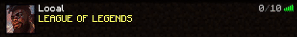

# LeagueServerIcon

This repository contains a small spigot plugin which randomly chooses a league of legends champion icon as server icon on every
ping to the server.

# Build

When activating the Maven Profile "Build Icons" the npm tool [sharp](https://www.npmjs.com/package/sharp) is used to
scale down the original champion-icons to
64x64 px.